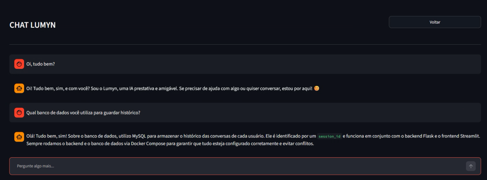

# LUMYN

O **Lumyn** é um assistente de inteligência artificial contextualizado que utiliza a técnica de **Retrieval-Augmented Generation** para responder a dúvidas com base em documentos customizados. O projeto conta com uma arquitetura dividida em microsserviços, histórico de conversas persistente e isolamento de sessões web.
<p align="center">
  
</p>

## Estrutura do projeto
```
LUMYN/
├── backend/
│   ├── src/
│   │   ├── config/            # Verificação da chave de API
│   │   ├── controllers/       # Rotas da API Flask
│   │   ├── dao/               # Acesso ao banco de dados MySQL
│   │   ├── database/          # Conexão com o banco
│   │   ├── knowledge_base/    # Processamento e embeddings para RAG
│   │   └── services/          # Lógica de integração com a IA
│   ├── Dockerfile
│   ├── main.py
│   └── requirements.txt
├── frontend/
│   ├── index.py               # Interface Streamlit
│   ├── Dockerfile
│   └── requirements.txt
├── docker-compose.yml
└── README.md
```

## Funcionalidades

* Chat conversacional com histórico persistente por sessão
* Integração com banco vetorial local para processamento, quebra e armazenamento de embeddings de documentos locais, servindo de contexto para as respostas da LLM.
* Busca semântica via ChromaDB e embeddings (HuggingFace `sentence-transformers`)
* Geração dinâmica de UUIDs por aba do navegador no frontend, garantindo que o histórico de chat de um usuário seja isolado e privado.
* Armazenamento das mensagens de chat (usuário e assistente) em banco de dados relacional MySQL.
* Toda a aplicação (Frontend, Backend, Banco Vetorial e Banco Relacional) funciona de forma isolada e integrada via Docker Compose.

## Fluxo de mensagem

1. O usuário envia uma pergunta pela interface do Streamlit.
2. O backend Flask salva a mensagem no MySQL e busca o histórico da conversa.
3. O ChromaDB é consultado por similaridade semântica, recuperando trechos relevantes da base de conhecimento.
4. O contexto recuperado é injetado no prompt enviado à API da OpenRouter.
5. A resposta da IA é salva no banco e devolvida ao frontend.


## Tecnologias utilizadas

- **Frontend:** Streamlit (Python)
- **Backend:** Flask (Python)
- **Banco relacional:** MySQL
- **Banco vetorial:** ChromaDB
- **Organização:** Docker e Docker Compose
- **API de IA:** OpenRouter API

## Pré-requisitos

- Docker e Docker compose
- Chave de API do OpenRouter

## Como executar no modo desenvolvimento

1. Clone o repositório e mude o diretório
   ```bash
   git clone https://github.com/luafxrreira/lumyn.git
   cd lumyn
   ```

2. Copie o arquivo `.env.example` para `.env` e altere sua chave de API e informações do banco de dados:
   ```bash
   cp .env.example .env
   ```

3. Na raiz do projeto, ative os containers do Docker:
   ```bash
   docker compose up -d
   ```

4. Acesse a aplicação:
- Frontend: `http://localhost:8501`
- Backend: `http://localhost:5001`

# Info: padrão de commits
O projeto adota a padronização Conventional Commits para manter o histórico de desenvolvimento organizado.
- **feat**: uma nova funcionalidade.
- **fix**: correção de bug.
- **refactor**: melhora a estrutura de código sem a adição de novas funcionalidades.
- **chore**: mudança de configuração ou ferramentas de build. 